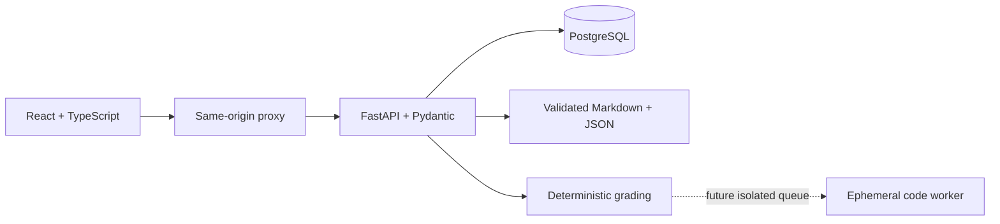

# Architecture and migration

## Milestone 1 foundation

The static reader is preserved. Versioned JSON manifests, Markdown and validators separate content from application code. All 25 packages are partial. Browser migration retains the previous key and backup; browser checks are unverified practice evidence.

## Milestone 2: implemented full stack

SQLAlchemy/Alembic own durable users, sessions, enrollment, immutable attempts, notes and progress. Revision 0002 pins new attempts to their question-specification digest while preserving old attempts with a null digest; the digest stays server-side and is not returned in learner APIs. Enrollment can be explicitly updated to a new package version without rewriting its prior attempts. Current-version gradebooks exclude historical attempts while attempt history retains them. Guest sessions permit practice without registration. Cookies contain opaque tokens; only digests are stored. Argon2 hashes passwords. Every personal-data operation checks ownership. Same-origin/CSRF checks protect mutations.

Learner DTOs expose prompts, allowed response shapes, readings, rubrics and provenance; exclude assessment solution specifications and unreleased solution feedback. Frontend assets contain no content banks. The API reads content separately and records course and grading-policy versions. New attempts also pin an exact question-specification digest. Immutable course/rubric archives, package digests and randomized variant seeds remain milestone 3 work for reproducible regrading.

No submitted Python runs in the API; no Docker socket is mounted. Optional feedback providers are future extensions and cannot mutate deterministic scores. Credentials come from server secrets.

## Compatibility

Retain IDs and original notes. Move the static reader into an explicit legacy directory when React replaces it. Never silently import editable client scores as server grades. A future import preview must retain provenance and avoid overwrites. Public authoring answers remain public even when absent from frontend bundles.

Tests cover content/DTO exclusions, authentication, ownership, grading, persistence and compatibility. Actual implementation boundaries are in the roadmap and validation report.

## Runtime configuration and limitations

Development Compose generates a random password in a named volume before PostgreSQL initialization. Only the API and database can read it. Database ports are not published, API is internal, and web binds localhost. Migration runs before API health. The API runs as UID 10001 with a read-only filesystem and temporary `/tmp`; no socket or submitted-code execution path exists. nginx supplies CSP, MIME-sniffing and framing protections; Markdown raw HTML is disabled.

Attempts pin enrollment course versions and retain server feedback. Numeric grading converts a bounded subset of SI/biological units and applies authored absolute plus bounded relative tolerance; optional significant figures (1–12) are checked against the entered decimal/scientific notation after tolerance passes. Unsupported dimensions and variants fail closed. Gradebook is formative best-per-item evidence, not mastery or a semester grade. Authenticated personal operations check ownership and CSRF plus exact origin. Guest conversion retains data; export excludes credential hashes/tokens. Write races return safe 409 for retry. Shared rate limiting, atomic upserts, retention, recovery/verification, digest/version migration and secure exam policy remain production hardening work.

The legacy reader remains outside the web image. It runs separately on port 4173 for local study and retains browser storage. No automatic local-score import is claimed. Source/answer authorship is open; runtime DTO withholding is not a claim that repository practice keys are secret.
