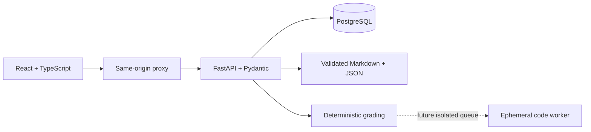

# Architecture and migration

## Milestone 1 foundation

The static reader is preserved. Versioned JSON manifests, Markdown and validators separate content from application code. All 25 packages are partial. Browser migration retains the previous key and backup; browser checks are unverified practice evidence.

## Full-stack target

SQLAlchemy/Alembic own durable users, sessions, enrollment, immutable attempts, notes and progress. Guest sessions permit practice without registration. Cookies contain opaque tokens; only digests are stored. Argon2 hashes passwords. Every personal-data operation checks ownership. Same-origin/CSRF checks protect mutations.

Learner DTOs expose prompts, allowed response shapes, readings, rubrics and provenance; exclude solution specifications and unreleased solutions. Frontend assets contain no content banks. The API reads content separately and records versions for reproducible attempts.

No submitted Python runs in the API; no Docker socket is mounted. Optional feedback providers are future extensions and cannot mutate deterministic scores. Credentials come from server secrets.

## Compatibility

Retain IDs and original notes. Move the static reader into an explicit legacy directory when React replaces it. Never silently import editable client scores as server grades. A future import preview must retain provenance and avoid overwrites. Public authoring answers remain public even when absent from frontend bundles.

Tests cover content/DTO exclusions, authentication, ownership, grading, persistence and compatibility. Actual implementation boundaries are in the roadmap and validation report.
