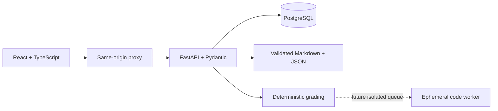

# Architecture and migration

## Milestone 1 foundation

The static reader is preserved. Versioned JSON manifests, Markdown and validators separate content from application code. All 25 packages are partial. Browser migration retains the previous key and backup; browser checks are unverified practice evidence.

## Milestone 2: implemented full stack

SQLAlchemy/Alembic own durable users, sessions, enrollment, immutable practice attempts, versioned assessment plans/instances, graded submissions, notes, progress, appeal requests and append-only review decisions. Revision 0002 pins new practice attempts to their question-specification digest while preserving old attempts with a null digest; the digest stays server-side and is not returned in learner APIs. Revision 0003 adds one learner appeal per practice attempt and one instructor decision per appeal without rewriting the deterministic score/result; approved adjustments are separately reflected in the formative gradebook. Revision 0004 adds an operator-provisioned instructor role, defaulting all existing accounts to no review access. Revisions 0005 and 0006 snapshot assessment policy/source hashes and persist assignment submissions by learner, course version, activity and attempt number. Enrollment can be explicitly updated to a new package version without rewriting prior submissions. Current-version gradebooks exclude historical work while history retains it. Guest sessions permit local study without registration. Cookies contain opaque tokens; only digests are stored. Argon2 hashes passwords. Every personal-data operation checks ownership. Same-origin/CSRF checks protect mutations.

Human review requires a registered account with an operator-provisioned `is_instructor` role. Registration cannot assign this role; the `manage_instructor` CLI is the only grant/revoke path and operators verify identity outside the application. Reviewers cannot adjudicate their own attempts. The instructor view shows the saved variant prompt, options, learner response and automatic feedback only when the course version and question-specification digest match. If the specification is missing or changed, score adjustments and upheld decisions are blocked; a reviewer may record a decline explaining the limitation. Original attempts remain unchanged, reviewer decisions are immutable, deleting a learner removes their requests, and deleting a reviewer anonymizes their actor reference while preserving the decision record. Historical package archives remain future work.

Learner DTOs expose prompts, allowed response shapes, readings, rubrics and provenance; exclude assessment solution specifications and unreleased solution feedback. Frontend assets contain no content banks. The API reads content separately and records course and grading-policy versions. New attempts also pin an exact question-specification digest. For formative authored variants, the API issues a signed token containing a random seed and context; deterministic keyed selection returns the same authored variant when submitted. Attempts store the variant ID with the resolved-spec digest. Immutable course/rubric archives remain necessary for full historical regrading; a digest alone cannot restore retired content.

Enrollment also creates an immutable `AssessmentPlan` and its `AssessmentInstance` rows for that content version. Snapshots include policy/category weights, assignment metadata, schedule/attempt rules, private authoring paths and per-source SHA-256 values. `GET /api/v1/assessments/{course_id}` requires enrollment and returns only display-safe fields; it does not return paths, question IDs, digests, or answer-bearing files. Updating an enrollment version appends the new snapshot while retaining the old rows. Legacy enrollments lazily initialize a snapshot only when their pinned version matches the currently installed manifest; older package files are not currently archived.

Weighted-grade math uses exact `Decimal` arithmetic and is isolated in `courselab.assessment`. It validates complete category mapping and supported attempt policies. The tested current-to-date calculation excludes unreleased work, counts missing work as zero strictly after its due time, selects a bounded `highest` or `latest` attempt, and normalizes active category weights. Revision 0006 adds protected question DTOs and append-only submission/history routes. The API verifies the pinned source SHA-256, enforces release/deadline/attempt rules, uses existing deterministic graders, stores criterion feedback and connects selected attempts to the calculator. The frontend completes the flow and shows the configured weighted result separately from formative practice. Only strict deadlines are supported; late penalties, manual review of graded submissions and historical content restoration are not yet implemented. The API path is exercised with a synthetic fixture; all 25 live packages remain formative-only and show no course grade.

`content/curriculum-map.json` stores eight pathway sequences and catalog-only nodes independently from course packages. The API merges package manifests with planned nodes in `/api/v1/curriculum`; it labels each maturity and includes explicit prerequisite edges. The React catalog uses native expandable sections to show the sequence, dependencies, related partial packages, and source links. Catalog-only nodes cannot be enrolled. The validator checks the combined graph and the required engineering/JHU coverage; this planning map is not a university-reviewed curriculum.

No submitted Python runs in the API; no Docker socket is mounted. Optional feedback providers are future extensions and cannot mutate deterministic scores. Credentials come from server secrets.

## Compatibility

Retain IDs and original notes. Move the static reader into an explicit legacy directory when React replaces it. Never silently import editable client scores as server grades. A future import preview must retain provenance and avoid overwrites. Public authoring answers remain public even when absent from frontend bundles.

Tests cover content/DTO exclusions, authentication, ownership, grading, persistence and compatibility. Actual implementation boundaries are in the roadmap and validation report.

## Runtime configuration and limitations

Development Compose generates a random password in a named volume before PostgreSQL initialization. Only the API and database can read it. Database ports are not published, API is internal, and web binds localhost. Migration runs before API health. The API runs as UID 10001 with a read-only filesystem and temporary `/tmp`; no socket or submitted-code execution path exists. nginx supplies CSP, MIME-sniffing and framing protections; Markdown raw HTML is disabled.

Attempts pin enrollment course versions and retain server feedback. Numeric grading converts a bounded subset of SI/biological units and applies authored absolute plus bounded relative tolerance; optional significant figures (1–12) are checked against the entered decimal/scientific notation after tolerance passes. Unsupported dimensions and variants fail closed. Objective evidence uses each distinct item's best formative score and exposes a provisional study indicator only after documented breadth, coverage and score thresholds pass. This does not establish sound reasoning, transfer, complete outcome mastery or a semester grade. Authenticated personal operations check ownership and CSRF plus exact origin. Guest conversion retains data; export excludes credential hashes/tokens. Write races return safe 409 for retry. Shared rate limiting, atomic upserts, retention, recovery/verification, digest/version migration and secure exam policy remain production hardening work.

Symbolic practice uses an AST allowlist to construct only bounded rational expressions before SymPy cancels their difference. Submitted text is never evaluated as Python. The grammar and complexity caps intentionally exclude general-purpose SymPy and calculus notation.

The legacy reader remains outside the web image. It runs separately on port 4173 for local study and retains browser storage. No automatic local-score import is claimed. Source/answer authorship is open; runtime DTO withholding is not a claim that repository practice keys are secret.
